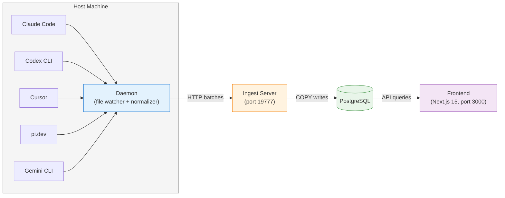

# QuickCall OpenTrace Architecture

## Overview

QuickCall OpenTrace is a multi-CLI AI coding session tracer. It reads session files from multiple AI CLI tools (Claude Code, Codex CLI, Gemini CLI, Cursor, pi.dev), normalizes them into a common schema, and stores them in PostgreSQL with a web UI for browsing.

## Components



| Component | Language | Responsibility |
|-----------|----------|----------------|
| **Daemon** | Python 3.12 | Polls session directories, normalizes files, pushes batches |
| **Ingest Server** | Python 3.12 | HTTP API: auth, validation, dedup, COPY to Postgres |
| **Frontend** | Next.js 15 + TypeScript | Browse sessions, gantt timeline, message viewer |
| **PostgreSQL** | Postgres 16 | Persistent storage, relational schema |

## Data Flow

### 1. Discovery (Daemon)

The daemon polls `~/.claude`, `~/.codex`, `~/.gemini`, `~/.cursor`, `~/.pi` for new or changed session files. Each source has a glob pattern:

| Source | Glob | Strategy |
|--------|------|----------|
| Claude Code | `~/.claude/projects/**/*.jsonl` | Line-resume (JSONL) |
| Codex CLI | `~/.codex/sessions/*/*/*/rollout-*.jsonl` | Line-resume (JSONL) |
| Gemini CLI | `~/.gemini/tmp/*/chats/session-*.json` | Content-hash |
| Cursor | `~/.cursor/projects/*/agent-transcripts/*.txt` + `state.vscdb` | Content-hash |
| pi.dev | `~/.pi/agent/sessions/**/*.jsonl` | Line-resume (JSONL) |

### 2. Normalization (Collector)

Each source has a dedicated transform that converts raw session events into `NormalizedMessage`:

```python
@dataclass
class NormalizedMessage:
    id: str
    session_id: str
    source: str          # "claude_code", "codex_cli", etc.
    msg_type: str        # "user", "assistant", "tool_call", "tool_result", "system"
    timestamp: str       # ISO 8601
    content: str
    thinking: str | None
    model: str | None
    token_usage: TokenUsage | None
    tool_calls: list[ToolCall] | None
    session_context: SessionContext
    raw_file_path: str
```

`SessionContext` carries git metadata:

```python
@dataclass
class SessionContext:
    cwd: str
    git_branch: str | None
    repo_name: str | None
    repo_url: str | None
    git_commit: str | None
    org: str | None
```

### 3. Push (Pusher)

Messages accumulate in memory (cap: 10,000 per poll cycle). Pushed in `batch_size=500` chunks via HTTP POST to `/ingest`:

```http
POST /ingest
X-API-Key: push_key
Content-Type: application/json

[{"id": "...", "session_id": "...", ...}, ...]
```

Failed batches go to a retry queue (max: 10,000 messages) with exponential backoff (1s → 60s cap).

### 4. Ingest (Server)

1. **Auth** — `X-API-Key` header checked against `QUICKCALL_OPENTRACE_PUSH_KEYS`
2. **Validation** — JSON schema validation per message
3. **Deduplication** — `ON CONFLICT (source, session_id, id) DO NOTHING`
4. **Bulk insert** — `COPY FROM STDIN` for performance (~10K msgs/sec)
5. **Progress report** — Daemon reports `last_line_read` per file; server stores in `file_progress`

### 5. Query (Frontend)

```http
GET /api/sessions?source=claude_code&repo_name=foo&limit=50
Authorization: Bearer admin_key
```

Frontend renders:
- **Sidebar**: Gantt timeline of sessions per source
- **Message view**: Threaded conversation with tool calls, thinking blocks
- **Stats**: Aggregate token usage, model distribution

## Database Schema

```sql
-- Core tables
sessions        -- one row per session
messages        -- one row per normalized message
tool_calls      -- extracted tool calls
tool_results    -- tool execution results
token_usage     -- per-message token counts
file_progress   -- daemon-reported read positions

-- Metadata
schema_version  -- migration tracking
```

Key design choices:
- `source + session_id + id` unique constraint for idempotency
- `COPY FROM STDIN` for bulk writes (10× faster than INSERT)
- `file_progress` enables resume without re-pushing

## Auth Model

Two-tier key system:

| Key type | Env var | Endpoints | Purpose |
|----------|---------|-----------|---------|
| **Admin** | `QUICKCALL_OPENTRACE_ADMIN_KEYS` | `/api/*`, `/stats`, `/sync` | Query, management |
| **Push** | `QUICKCALL_OPENTRACE_PUSH_KEYS` | `/ingest` | Daemon submission |

No OAuth, no sessions, no JWT. Simple shared-secret model for local/self-hosted use.

## Deployment Patterns

### A. Full stack (Docker Compose)

```bash
git clone https://github.com/quickcall-dev/opentrace.git
cd opentrace
quickcall up
```

Services: Postgres + server + daemon + frontend. One command.

### B. Backend only (BYOP)

```bash
pip install quickcall-opentrace
export QUICKCALL_OPENTRACE_DSN="postgresql://..."
quickcall init
quickcall-server
quickcall-daemon
```

No Docker, no frontend. User brings their own Postgres.

### C. Multi-machine → one DB

Multiple workstations run `quickcall-daemon` against a shared Postgres:

```
Machine A (daemon) ──┐
Machine B (daemon) ──┼──→ Postgres ←── quickcall-server
Machine C (daemon) ──┘
```

Each daemon tags sessions with `device_id`.

## Key Design Decisions

| Decision | Rationale |
|----------|-----------|
| **Line-resume for JSONL** | Append-only files = cheap resume; no re-reading |
| **Content-hash for Cursor/Gemini** | Non-append files need hash-based change detection |
| **HTTP push, not direct DB** | Daemon runs as user process; may not have DB credentials |
| **COPY FROM STDIN** | 10× faster than row-by-row INSERT for bulk ingestion |
| **Two-tier auth** | Simple, no sessions/JWT, works for local and shared deployments |
| **Org tagging** | Enables multi-tenant use without schema changes |
| **No ORM** | Raw SQL + psycopg for control and performance |
| **Schema version table** | Auto-migration on server startup |

## Extension Points

Adding a new CLI source:

1. **Transform** — `opentrace/schemas/<source>/transform.py`
2. **Collector** — `opentrace/daemon/collector.py` → `_collect_<source>()`
3. **Config** — `opentrace/daemon/config.py` → add glob pattern
4. **Tests** — fixtures in `tests/fixtures/`, tests in `tests/schemas/`, `tests/daemon/`
5. **UI** — add to `GANTT_COLORS`, `SOURCE_LABELS` in frontend

No server or DB changes needed.
